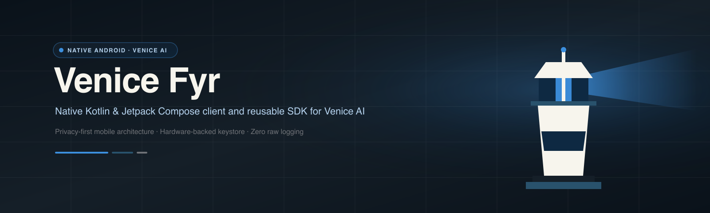

# Venice Fyr

Native Android port foundation for Venice Forge `3.0.0-beta.2` — a native Kotlin/Jetpack Compose client and reusable SDK for Venice AI.

<p align="center">
  
</p>

<p align="center">
  <strong>Native Android access to Venice AI — built as an app, an SDK, and a long-term mobile port of Venice Forge.</strong>
</p>

<p align="center">
  
  
  
  
  
</p>

> [!IMPORTANT]
> Venice Fyr is in active development. The repository is a native Android port of Venice Forge, not a finished feature-parity release. Consult the tracked parity and implementation documents before assuming a desktop feature is already available on Android.

---

## What is Venice Fyr?

**Venice Fyr** is the mobile evolution of Venice Forge: a native Kotlin/Jetpack Compose Android client for Venice AI plus a reusable Android SDK boundary for Venice API operations.

The project intentionally produces two primary deliverables:

- **`:app`** — the installable Android client (`APK` / `AAB`).
- **`:venice-sdk`** — a reusable Android library (`AAR`) for Venice API contracts and client operations.

The Android project ports behavior rather than wrapping the desktop Electron renderer. Electron IPC, stores, tests, API contracts, and security boundaries are treated as specifications to be translated into Android-native architecture.

---

## Current foundation

This repository is built around:

- Kotlin and Jetpack Compose.
- `compileSdk` / `targetSdk` 37.
- `minSdk` 26.
- JDK 17.
- Android Gradle Plugin 9.3.0.
- Gradle 9.5.0.
- Compose BOM 2026.06.00.
- OkHttp 5.3.0.
- `:app`, `:venice-sdk`, `:core:common`, `:core:security`, `:core:designsystem`, and `:core:data`.
- Android Keystore-backed app credential storage.
- HTTPS-only network-security policy.
- No telemetry by default.
- Runtime Venice model/capability discovery rather than static model allowlists.
- A read-only desktop source mirror used for parity work.

The repository evolves quickly. Treat the source tree and the parity matrix as authoritative if this README becomes stale.

---

## Architecture

```text
Venice-Fyr/
├── app/                  # Android application + Compose UI
├── venice-sdk/           # Reusable Venice API Android library
├── core/
│   ├── common/           # Shared primitives / redaction
│   ├── security/         # App-owned secure secret persistence
│   ├── designsystem/     # Shared Compose design system
│   └── data/             # Room-backed persistence layer
├── docs/                 # Architecture, parity, API-port and usage docs
└── scripts/              # Repository bootstrap / maintenance scripts
```

The SDK must not own persistent user credentials. Credential persistence belongs to the application/security layer.

---

## First run: download the desktop source of truth

The Android package is the implementation target. The current desktop app is intentionally kept as a separate read-only clone so an agent can inspect the real implementation and tests without contaminating the Android repository.

```bash
cd "/Users/super_user/Projects/Venice Fyr"
./scripts/bootstrap-desktop-source.sh
```

This creates/refreshes:

```text
/Users/super_user/Projects/Venice Fyr/.source/Venice_Forge-desktop/
```

from:

```text
https://github.com/spearchucker667/Venice_Forge.git
```

The exact source path, branch, remote, and commit SHA are written to the ignored `.local/desktop-source.env`. See `docs/DESKTOP_SOURCE_BOOTSTRAP.md` for the source precedence and feature-by-feature source map.

---

## Baseline captured for this starter

- Desktop app: Venice Forge `3.0.0-beta.2`
- Desktop canonical tabs: 22
- Desktop source archive inspected: `Venice_Forge-main.zip`
- Remote repository: `spearchucker667/Venice_Forge`, branch `main`
- Latest remote commit observed: `bc5c17374ef4937f5837f5580d29a88bfab333ee` (Media Studio capability-routing hardening)
- Venice API upstream snapshot recorded by desktop: commit `db3b9f4f40fe71abff2011bcaa9c23ad797c94f3`, retrieved `2026-08-14`
- Venice OpenAPI schema version: `20260814.153445`

---

## Quick start

### Prerequisites

Install:

- JDK 17
- Android Studio with support for AGP 9.3+
- Android SDK Platform 37
- Android Build Tools required by the project
- Git

Clone and inspect:

```bash
git clone https://github.com/spearchucker667/Venice-Fyr.git
cd Venice-Fyr
./gradlew --version
./gradlew projects
```

Build the Android app:

```bash
./gradlew :app:assembleDebug
```

Build the reusable SDK:

```bash
./gradlew :venice-sdk:assembleRelease
```

For complete environment setup, see [Getting Started](docs/GETTING_STARTED.md).

---

## Build

Debug application:

```bash
./gradlew :app:assembleDebug
```

SDK AAR:

```bash
./gradlew :venice-sdk:assembleRelease
```

Full baseline validation (from `AGENTS.md`):

```bash
./gradlew test lint :app:assembleDebug :venice-sdk:assembleRelease
```

Expected outputs after a successful build:

```text
app/build/outputs/apk/debug/app-debug.apk
venice-sdk/build/outputs/aar/venice-sdk-release.aar
```

---

## Project map

```text
app/                 Android application, Compose shell, feature registry
venice-sdk/          Public AAR boundary for Venice API operations
core/common/         Redaction and cross-cutting primitives
core/security/       App-owned Android Keystore secret persistence
core/designsystem/   Compose theme/design-system seed
docs/                Porting contract, parity matrix, architecture/security guidance
```

Do not implement Android features by embedding the Electron renderer in a WebView. Port domain behavior and contracts to native Kotlin/Compose components.

---

## Desktop source of truth

Port work uses the current Venice Forge desktop repository as a read-only behavioral reference.

From the normal local workspace:

```bash
./scripts/bootstrap-desktop-source.sh
```

The script prepares a local read-only mirror under `.source/` and records local state outside version control.

Before porting behavior, read:

- [`AGENTS.md`](AGENTS.md)
- [`ANDROID_PORT_HANDOFF.md`](ANDROID_PORT_HANDOFF.md)
- [`docs/DESKTOP_SOURCE_BOOTSTRAP.md`](docs/DESKTOP_SOURCE_BOOTSTRAP.md)
- [`docs/FEATURE_PARITY_MATRIX.md`](docs/FEATURE_PARITY_MATRIX.md)
- [`docs/VENICE_API_PORT_MATRIX.md`](docs/VENICE_API_PORT_MATRIX.md)
- [`docs/SECURITY_AND_STORAGE_CONTRACT.md`](docs/SECURITY_AND_STORAGE_CONTRACT.md)

---

## Development principles

1. **Native Android, not a WebView port.**
2. **Privacy and credential boundaries are architectural requirements.**
3. **Live model capabilities are runtime data.**
4. **Desktop behavior is inspected before Android parity work is claimed.**
5. **Paid or mutating operations require explicit approval and duplicate-submission defenses.**
6. **No raw API keys, prompts, responses, or sensitive local paths in logs.**
7. **Parity claims require evidence and updates to the parity matrix.**

---

## Documentation

| Document | Purpose |
|---|---|
| [Getting Started](docs/GETTING_STARTED.md) | Environment setup and first build |
| [User Guide](docs/USER_GUIDE.md) | Current user-facing behavior and safe expectations |
| [Development Guide](docs/DEVELOPMENT_GUIDE.md) | Repository workflow and validation |
| [SDK Guide](docs/SDK_GUIDE.md) | `:venice-sdk` integration and ownership boundaries |
| [Troubleshooting](docs/TROUBLESHOOTING.md) | Common build/toolchain failures |
| [Branding](docs/BRANDING.md) | Included README/social assets |
| [Contributing](CONTRIBUTING.md) | Contribution workflow |
| [Security](SECURITY.md) | Vulnerability reporting and security expectations |
| [Privacy](PRIVACY.md) | Privacy model and data handling |
| [Legal](LEGAL.md) | Legal/project notices |
| [License](LICENSE) | Apache License 2.0 |
| [Support](SUPPORT.md) | Where to ask for help |

Existing port-specific technical documents remain authoritative for parity details.

---

## Status and roadmap

The repository is being implemented incrementally. A feature is not considered complete merely because a navigation destination, interface, or placeholder exists.

Use [`docs/FEATURE_PARITY_MATRIX.md`](docs/FEATURE_PARITY_MATRIX.md) for the current parity state. Implementation plans under `docs/superpowers/` may describe work that is planned, in progress, or recently completed; source code and tests decide what is actually implemented.

---

## Contributing

Contributions are welcome, but this project has unusually strict parity, privacy, and API-contract requirements.

Read [`CONTRIBUTING.md`](CONTRIBUTING.md) and [`AGENTS.md`](AGENTS.md) before changing code. Avoid implementing Venice behavior from memory when the source repositories or API references provide an answer.

---

## Security

Do not post API keys, tokens, private prompts, personal data, or exploitable vulnerability details in public issues.

See [`SECURITY.md`](SECURITY.md).

---

## License

Unless a file states otherwise, Venice Fyr is distributed under the **Apache License 2.0**. See [`LICENSE`](LICENSE) and [`NOTICE`](NOTICE).

Third-party software and services remain subject to their own licenses and terms.

---

## Project relationship

Venice Fyr is an independently maintained client project built to interoperate with Venice AI. Product names, trademarks, service terms, generated-content policies, and upstream APIs remain the responsibility of their respective owners.
